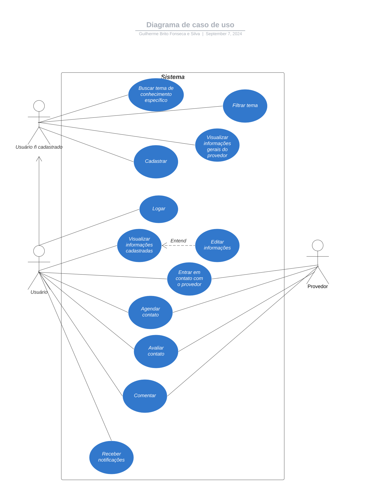

# Especificações do Projeto

Pré-requisitos: <a href="1-Documentação de Contexto.md"> Documentação de Contexto</a>

Definição do problema e ideia de solução a partir da perspectiva do usuário. É composta pela definição do  diagrama de personas, histórias de usuários, requisitos funcionais e não funcionais além das restrições do projeto.

Apresente uma visão geral do que será abordado nesta parte do documento, enumerando as técnicas e/ou ferramentas utilizadas para realizar a especificações do projeto

## Personas

### Persona 1: Gabriel

| **Atributo**        | **Informação**                                    |
|---------------------|---------------------------------------------------|
| **Nome**            | Gabriel                                           |
| **Sexo**            | Masculino                                         |
| **Gênero**          | Cisgênero                                         |
| **Idade**           | 35 anos                                           |
| **Estado civil**    | Casado                                            |
| **Tem filhos?**     | Sim                                               |
| **Profissão**       | Policial militar                                  |
| **Renda**           | <= 3 mil                                          |
| **Escolaridade**    | Graduação                                         |
| **Residente**       | Vitória da Conquista - BA                         |
| **Hobbies**         | Jogar boliche, tocar violão e assistir filmes de CSI |

---

### Persona 2: Julia

| **Atributo**        | **Informação**                                    |
|---------------------|---------------------------------------------------|
| **Nome**            | Julia                                             |
| **Sexo**            | Feminino                                          |
| **Gênero**          | Cisgênero                                         |
| **Idade**           | 17 anos                                           |
| **Estado civil**    | Solteira                                          |
| **Tem filhos?**     | Não                                               |
| **Profissão**       | Estudante                                         |
| **Renda**           | n/a                                               |
| **Escolaridade**    | Ensino médio incompleto                           |
| **Residente**       | São Caetano do Sul - SP                           |
| **Hobbies**         | Assistir vídeos curtos de maquiagem, sair com amigos e andar de bicicleta |

---

### Persona 3: Ivo

| **Atributo**        | **Informação**                                    |
|---------------------|---------------------------------------------------|
| **Nome**            | Ivo                                               |
| **Sexo**            | Masculino                                         |
| **Gênero**          | Não binário                                       |
| **Idade**           | 45 anos                                           |
| **Estado civil**    | Divorciado                                        |
| **Tem filhos?**     | Não                                               |
| **Profissão**       | Gerente de Marketing                              |
| **Renda**           | <= 10 mil                                         |
| **Escolaridade**    | Pós-graduação                                     |
| **Residente**       | Cuiabá - MT                                       |
| **Hobbies**         | Viajar, cozinhar e ler livros de negócios         |

---

### Persona 4: Lucas

| **Atributo**        | **Informação**                                    |
|---------------------|---------------------------------------------------|
| **Nome**            | Lucas                                             |
| **Sexo**            | Masculino                                         |
| **Gênero**          | Transgênero                                       |
| **Idade**           | 26 anos                                           |
| **Estado civil**    | Casado                                            |
| **Tem filhos?**     | Sim                                               |
| **Profissão**       | Professor de história                             |
| **Renda**           | <= 3 mil                                          |
| **Escolaridade**    | Mestrado                                          |
| **Residente**       | Belo Horizonte - MG                               |
| **Hobbies**         | Jogar jogos de tabuleiro, estar em família e assistir corridas de carro |

---

### Persona 5: Miguel

| **Atributo**        | **Informação**                                    |
|---------------------|---------------------------------------------------|
| **Nome**            | Miguel                                            |
| **Sexo**            | Masculino                                         |
| **Gênero**          | Cisgênero                                         |
| **Idade**           | 14 anos                                           |
| **Estado civil**    | Solteiro                                          |
| **Tem filhos?**     | Não                                               |
| **Profissão**       | Estudante                                         |
| **Renda**           | n/a                                               |
| **Escolaridade**    | Ensino fundamental incompleto                     |
| **Residente**       | Rio Branco - AC                                   |
| **Hobbies**         | Andar de skate, tocar guitarra e fazer doces      |

---

### Persona 6: Luara

| **Atributo**        | **Informação**                                    |
|---------------------|---------------------------------------------------|
| **Nome**            | Luara                                             |
| **Sexo**            | Feminino                                          |
| **Gênero**          | Transgênero                                       |
| **Idade**           | 28 anos                                           |
| **Estado civil**    | Solteira                                          |
| **Tem filhos?**     | Sim                                               |
| **Profissão**       | Analista de Sistemas                              |
| **Renda**           | <= 6 mil                                          |
| **Escolaridade**    | Graduação                                         |
| **Residente**       | Fortaleza - CE                                    |
| **Hobbies**         | Pintura, Corrida e Tocar piano                    |

## Histórias de Usuários

Com base na análise das personas forma identificadas as seguintes histórias de usuários:

| |**Gabriel**                              | **Idade:** 35 anos                                              |
|---------------------------------------------------------|------------------------------------------|-----------------------------------------------------------------|
| **Ocupação:**                                           | Policial Militar                                                |
| **Funcionalidade:**                                     | Quero um espaço que permita compartilhar e aprender sobre técnicas de segurança e investigação com outras pessoas. |
| **Motivações:**                                         | Aumentar sua rede de conhecimentos práticos e teóricos na área de segurança. |
| **Interesses Adicionais:**                              | Música, troca de experiências sobre tocar violão.                |
| **Frustrações:**                                        | Dificuldade em encontrar uma plataforma confiável para compartilhar e aprender sobre segurança de forma interativa. |

---

|    | **Julia**                                | **Idade:** 17 anos                                              |
|---------------------------------------------------------|------------------------------------------|-----------------------------------------------------------------|
| **Ocupação:**                                           | Estudante                                                       |
| **Funcionalidade:**                                     | Uma funcionalidade que permita trocar dicas de maquiagem e estilo com outras pessoas. |
| **Motivações:**                                         | Se expressar melhor através da maquiagem e moda.                |
| **Interesses Adicionais:**                              | Descobrir novas tendências e fazer novas amizades com interesses semelhantes. |
| **Frustrações:**                                        | Falta de conexão com outras pessoas que compartilham os mesmos interesses em moda. |

---

|      | **Ivo**                                  | **Idade:** 40 anos                                              |
|---------------------------------------------------------|------------------------------------------|-----------------------------------------------------------------|
| **Ocupação:**                                           | Gerente de Marketing                                             |
| **Funcionalidade:**                                     | Quero poder compartilhar conhecimentos de marketing e aprender sobre culinária e viagens. |
| **Motivações:**                                         | Enriquecer habilidades profissionais e explorar novas paixões pessoais. |
| **Interesses Adicionais:**                              | Conectar-se com pessoas que podem ensinar algo novo, especialmente em culinária e viagens. |
| **Frustrações:**                                        | Dificuldade em encontrar um equilíbrio entre interesses profissionais e pessoais em uma única plataforma. |

---

|    | **Lucas**                                | **Idade:** 30 anos                                              |
|---------------------------------------------------------|------------------------------------------|-----------------------------------------------------------------|
| **Ocupação:**                                           | Professor de História                                           |
| **Funcionalidade:**                                     | Gostaria de ter uma funcionalide que permita trocar conhecimentos sobre história e estratégias de ensino com outros usuários. |
| **Motivações:**                                         | Melhorar técnicas de ensino e tornar as aulas mais interativas e interessantes. |
| **Interesses Adicionais:**                              | Jogos de tabuleiro, conectando-se com outros apaixonados por história e jogos. |
| **Frustrações:**                                        | Falta de ferramentas para combinar seus interesses em história e jogos com suas técnicas de ensino. |

---

|   | **Miguel**                               | **Idade:** 14 anos                                              |
|---------------------------------------------------------|------------------------------------------|-----------------------------------------------------------------|
| **Ocupação:**                                           | Estudante                                                       |
| **Funcionalidade:**                                     | Uma funcionalidade que permita aprender a tocar guitarra e compartilhar experiências no skate com outros jovens. |
| **Motivações:**                                         | Melhorar habilidades musicais e de skate, conectando-se com outros jovens. |
| **Interesses Adicionais:**                              | Aprender a fazer novos tipos de doces para compartilhar com a família e amigos. |
| **Frustrações:**                                        | Dificuldade em encontrar uma comunidade jovem com interesses semelhantes. |

---

|    | **Luara**                                | **Idade:** 28 anos                                              |
|---------------------------------------------------------|------------------------------------------|-----------------------------------------------------------------|
| **Ocupação:**                                           | Analista de Sistemas                                            |
| **Funcionalidade:**                                     | Um app que permita trocar conhecimentos sobre pintura, corrida e piano com outros usuários. |
| **Motivações:**                                         | Melhorar habilidades nessas áreas e encontrar uma comunidade de interesses semelhantes. |
| **Interesses Adicionais:**                              | Integrar hobbies criativos à vida profissional e pessoal.        |
| **Frustrações:**                                        | Dificuldade em equilibrar trabalho com hobbies e encontrar uma comunidade para compartilhar dicas. |

---

|    | **Administrador da Aplicação**           |                                                                 |
|---------------------------------------------------------|------------------------------------------|-----------------------------------------------------------------|
| **Funcionalidade:**                                     | Efetuar alteração das permissões das contas dos usuários.        |
| **Motivações:**                                         | Permitir que os usuários administrem suas próprias contas de maneira eficiente. |
| **Frustrações:**                                        | Restrições no controle administrativo das funcionalidades dos usuários. |

Apresente aqui as histórias de usuário que são relevantes para o projeto de sua solução. As Histórias de Usuário consistem em uma ferramenta poderosa para a compreensão e elicitação dos requisitos funcionais e não funcionais da sua aplicação. Se possível, agrupe as histórias de usuário por contexto, para facilitar consultas recorrentes à essa parte do documento.

## Modelagem do Processo de Negócio 

### Análise da Situação Atual

Apresente aqui os problemas existentes que viabilizam sua proposta. Apresente o modelo do sistema como ele funciona hoje. Caso sua proposta seja inovadora e não existam processos claramente definidos, apresente como as tarefas que o seu sistema pretende implementar são executadas atualmente, mesmo que não se utilize tecnologia computacional. 

### Descrição Geral da Proposta

Apresente aqui uma descrição da sua proposta abordando seus limites e suas ligações com as estratégias e objetivos do negócio. Apresente aqui as oportunidades de melhorias.

### Processo 1 – NOME DO PROCESSO

Apresente aqui o nome e as oportunidades de melhorias para o processo 1. Em seguida, apresente o modelo do processo 1, descrito no padrão BPMN. 

### Processo 2 – NOME DO PROCESSO

Apresente aqui o nome e as oportunidades de melhorias para o processo 2. Em seguida, apresente o modelo do processo 2, descrito no padrão BPMN.

## Indicadores de Desempenho

Apresente aqui os principais indicadores de desempenho e algumas metas para o processo. Atenção: as informações necessárias para gerar os indicadores devem estar contempladas no diagrama de classe. Colocar no mínimo 5 indicadores. 

Usar o seguinte modelo: 

Obs.: todas as informações para gerar os indicadores devem estar no diagrama de classe a ser apresentado a posteriori. 

## Requisitos

### Requisitos Funcionais

| ID    | Descrição do Requisito                                                                  | Prioridade |
|-------|-----------------------------------------------------------------------------------------|------------|
| RF-001| Permitir que os usuários se cadastrem na plataforma com informações pessoais e áreas de conhecimento | ALTA       |
| RF-002| Permitir que os usuários criem e editem seus perfis, incluindo descrição e histórico de atividades | ALTA       |
| RF-003| Permitir que usuários não cadastrados busquem por temas ou áreas de conhecimento na interface principal | ALTA       |
| RF-004| Exibir uma lista de conhecimentos disponíveis com detalhes sobre o provedor e formas de contato | ALTA       |
| RF-005| Permitir contato direto entre usuários interessados e provedores de conhecimento via e-mail ou telefone | ALTA       |
| RF-006| Permitir filtragem de resultados de busca por área de conhecimento e disponibilidade | MÉDIA      |
| RF-007| Permitir que os usuários avaliem e comentem sobre as experiências de aprendizado ou compartilhamento | MÉDIA      |
| RF-008| Enviar notificações por e-mail ou push sobre novos pedidos de conhecimento ou contatos recebidos | MÉDIA      |

### Requisitos Não Funcionais

| ID     | Descrição do Requisito                                                                 | Prioridade |
|--------|----------------------------------------------------------------------------------------|------------|
| RNF-001| O sistema deve ser intuitivo e fácil de navegar, proporcionando uma boa experiência do usuário| ALTA       |
| RNF-002| O sistema deve responder a solicitações de busca e filtro em menos de 5 segundos | ALTA       |
| RNF-003| O sistema deve ser escalável para suportar aumento de usuários e acessos simultâneos | ALTA       |
| RNF-004| A aplicação deve ser compatível com os principais sistemas operacionais do mercado. | ALTA      |
| RNF-005| O sistema deve implementar criptografia de dados, garantindo segurança e privacidade dos usuários| MÉDIA       |
| RNF-006| O sistema deve ser desenvolvido de forma modular, permitindo fácil manutenção e atualização | MÉDIA      |

## Restrições

O projeto está restrito pelos itens apresentados na tabela a seguir.

| ID     | Descrição da Restrição                                                                 |
|--------|----------------------------------------------------------------------------------------|
| RE-01  | O projeto deve ser entregue até o final do semestre letivo, com data limite em 23/06/2024. |
| RE-02  | O desenvolvimento do aplicativo deve utilizar exclusivamente as tecnologias disponíveis no framework selecionado. |
| RE-03  | A equipe de desenvolvimento não pode subcontratar terceiros para a realização do trabalho. |
| RE-04  | A aplicação deve ser desenvolvida exclusivamente para dispositivos móveis. |

## Diagrama de Casos de Uso

Abaixo, está o nosso diagrama de casos de uso que irá mostrar as etapas e caminhos que os usuários poderam fazer em nosso app mobile

O diagrama de casos de uso é o próximo passo após a elicitação de requisitos, que utiliza um modelo gráfico e uma tabela com as descrições sucintas dos casos de uso e dos atores. Ele contempla a fronteira do sistema e o detalhamento dos requisitos funcionais com a indicação dos atores, casos de uso e seus relacionamentos. 

As referências abaixo irão auxiliá-lo na geração do artefato “Diagrama de Casos de Uso”.

# Matriz de Rastreabilidade

A matriz de rastreabilidade é uma ferramenta usada para facilitar a visualização dos relacionamento entre requisitos e outros artefatos ou objetos, permitindo a rastreabilidade entre os requisitos e os objetivos de negócio. 

A matriz deve contemplar todos os elementos relevantes que fazem parte do sistema, conforme a figura meramente ilustrativa apresentada a seguir.

# Gerenciamento de Projeto

De acordo com o PMBoK v6 as dez áreas que constituem os pilares para gerenciar projetos, e que caracterizam a multidisciplinaridade envolvida, são: Integração, Escopo, Cronograma (Tempo), Custos, Qualidade, Recursos, Comunicações, Riscos, Aquisições, Partes Interessadas. Para desenvolver projetos um profissional deve se preocupar em gerenciar todas essas dez áreas. Elas se complementam e se relacionam, de tal forma que não se deve apenas examinar uma área de forma estanque. É preciso considerar, por exemplo, que as áreas de Escopo, Cronograma e Custos estão muito relacionadas. Assim, se eu amplio o escopo de um projeto eu posso afetar seu cronograma e seus custos.

## Gerenciamento de Tempo

Com diagramas bem organizados que permitem gerenciar o tempo nos projetos, o gerente de projetos agenda e coordena tarefas dentro de um projeto para estimar o tempo necessário de conclusão.

O gráfico de Gantt ou diagrama de Gantt também é uma ferramenta visual utilizada para controlar e gerenciar o cronograma de atividades de um projeto. Com ele, é possível listar tudo que precisa ser feito para colocar o projeto em prática, dividir em atividades e estimar o tempo necessário para executá-las.

## Gerenciamento de Equipe

O gerenciamento adequado de tarefas contribuirá para que o projeto alcance altos níveis de produtividade. Por isso, é fundamental que ocorra a gestão de tarefas e de pessoas, de modo que os times envolvidos no projeto possam ser facilmente gerenciados. 

## Gestão de Orçamento

O processo de determinar o orçamento do projeto é uma tarefa que depende, além dos produtos (saídas) dos processos anteriores do gerenciamento de custos, também de produtos oferecidos por outros processos de gerenciamento, como o escopo e o tempo.

